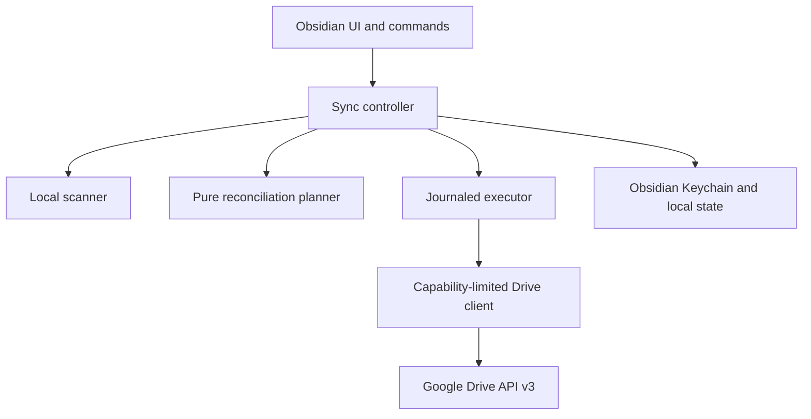

# Architecture

## Components

The planner has no UI, network, or filesystem dependency. The controller serializes triggers. The
executor persists intent before side effects and commits the remote manifest last.

## Authentication

Desktop creates random PKCE verifier/state, binds an ephemeral server to `127.0.0.1`, opens the
system browser, validates the callback, and exchanges the authorization code directly with Google.
Refresh tokens and any user-supplied Desktop client secret are stored through Obsidian's
SecretStorage API and managed in Obsidian Keychain, not ordinary plugin data. Mobile imports an
encrypted, expiring pairing bundle and writes the credential to its own Keychain. A legacy AES-GCM
envelope is supported only for one-time migration from 0.9.0.

## Drive layout

Visible content uses an app-created folder named `VaultBridge/<label>`, including
`.vaultbridge-recovery`. App data contains a versioned vault registry, one manifest per vault,
device records, and short-lived leases. Short `appProperties` carry only vault ID, logical ID, and
object type.

## Manifest and local database

The strict manifest records stable logical IDs, Drive IDs, normalized relative paths, hashes, source
mtime, parents, revisions, and tombstones. A local database records the device ID, last committed
base manifest, ETag when observed, cached local hashes, pending operations, journal, history, and
recovery records. It can be rebuilt from a remote manifest and fresh scan.

## Sync transaction

1. Scan local state and validate paths.
2. Fetch and validate registry and remote manifest.
3. Plan deterministically against the last common base.
4. Block unsafe or mass-destructive plans.
5. Journal intent; upload pending content and verify it.
6. Download to temporary local paths and verify hashes before replacement.
7. Apply moves, conflicts, tombstones, and recovery moves idempotently.
8. Acquire a short lease, revalidate remote revision, and commit the manifest last.
9. Mark local state committed and clean temporary artifacts.

An interruption before step 8 leaves the previous manifest authoritative. Pending/orphan objects are
safe to collect later because they are not manifest members.

## Conflict behavior

Divergent changes never use timestamp-wins. Both contents survive under a deterministic,
cross-platform-safe conflict filename. Identical hashes converge. Modify/delete and rename/delete
preserve a recovery copy and produce user action. A basic Markdown review view exposes
base/local/remote text and keep-local, keep-remote, keep-both, or manual resolution.

## Deletion lifecycle

A delete creates a tombstone, moves the remote object into recovery, propagates the tombstone, and
retains the object for 30 days by default. Stale snapshots do not recreate tombstoned logical IDs.
Purge is disabled by default and mass purge always requires confirmation.

## Failure recovery

Every operation has a stable ID and journal phase. Retries check postconditions before repeating
side effects. Hash mismatches abort. A corrupt manifest cannot produce a plan. Expired leases cease
blocking sync.
